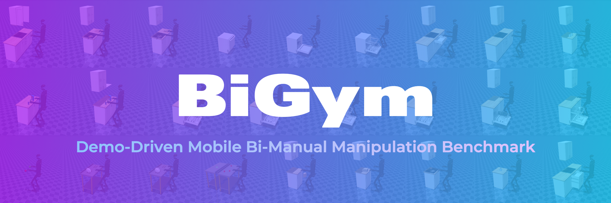
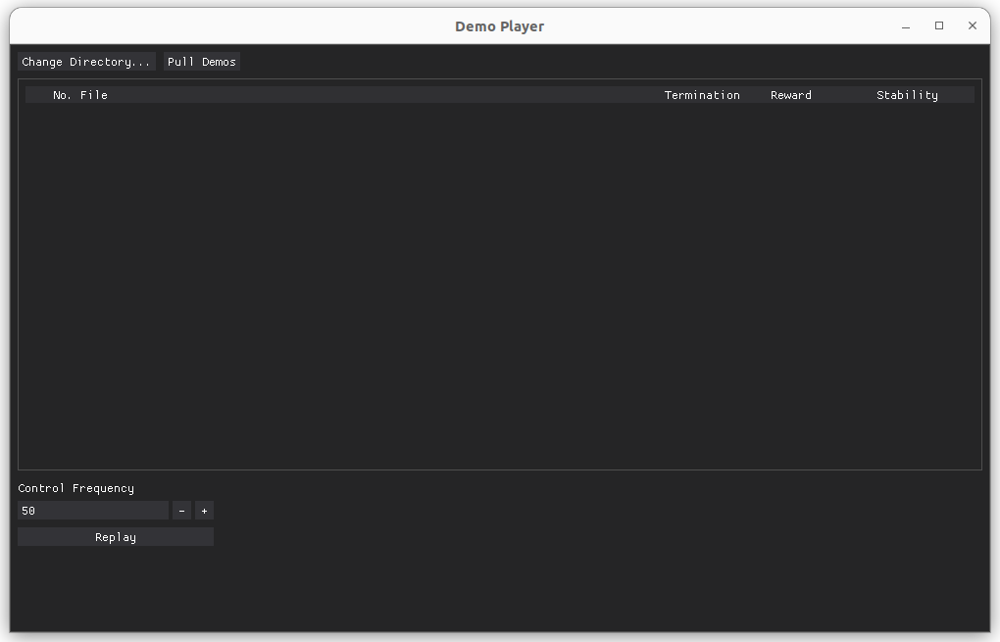

<h1>
  <a href="#"></a>
</h1>

<p>
  <a href="https://github.com/chernyadev/bigym/actions/workflows/build.yaml?query=branch%3Amaster" alt="GitHub Actions">
    
  </a>
  <a href="#contributing">
    
  </a>
</p>

[**BiGym: A Demo-Driven Mobile Bi-Manual Manipulation Benchmark**](https://arxiv.org/abs/2407.07788)\
[Nikita Cherniadev*](https://www.linkedin.com/in/nikita-cherniadev-8495417a/), [Nicholas Backshall*](https://www.linkedin.com/in/nicholas-backshall/?originalSubdomain=uk), [Xiao Ma*](https://yusufma03.github.io/), [Yunfan Lu](https://www.linkedin.com/in/yunfan-lu-90170992/?originalSubdomain=sg), [Younggyo Seo](https://younggyo.me/), [Stephen James](https://stepjam.github.io/)

BiGym is a new benchmark and learning environment for mobile bi-manual demo-driven robotic manipulation.
BiGym features 40 diverse tasks set in home environments, ranging from simple target reaching to complex kitchen cleaning. To capture the real-world performance accurately, we provide human-collected demonstrations for each task, reflecting the diverse modalities found in real-world robot trajectories. BiGym supports a variety of observations, including proprioceptive data and visual inputs such as RGB, and depth from 3 camera views.

For latest updates, check our project page: [https://chernyadev.github.io/bigym/](https://chernyadev.github.io/bigym/)

## Table of Contents

1. [Install](#install)
2. [Tasks](#tasks)
3. [Usage](#usage)
4. [Contributing](#contributing)

## Install

```commandline
pip install .
```

## Tasks

| Task                                                            | Description                                                                                                                                                                           | Preview                                                                                        |
|-----------------------------------------------------------------|---------------------------------------------------------------------------------------------------------------------------------------------------------------------------------------|------------------------------------------------------------------------------------------------|
| [ReachTarget](bigym/envs/reach_target.py)                       | Reach the target with either left or right wrist.                                                                                                                                     |                    |
| [ReachTargetSingle](bigym/envs/reach_target.py)                 | Reach the target with specific wrist.                                                                                                                                                 |             |
| [ReachTargetDual](bigym/envs/reach_target.py)                   | Reach 2 targets, one with each arm.                                                                                                                                                   |               |
| [StackBlocks](bigym/envs/manipulation.py)                       | Move blocks across the table, and stack them in the target area.                                                                                                                      |                    |
| [MovePlate](bigym/envs/move_plates.py)                          | Move the plate between two draining racks.                                                                                                                                            |                      |
| [MoveTwoPlates](bigym/envs/move_plates.py)                      | Move two plates simultaneously from one draining rack to the other.                                                                                                                   |                 |
| [FlipCup](bigym/envs/manipulation.py)                           | Flip the cup, initially positioned upside down on the table, to an upright position.                                                                                                  |                        |
| [FlipCutlery](bigym/envs/manipulation.py)                       | Take the cutlery from the static holder, flip it, and place it back into the holder.                                                                                                  |                    |
| [DishwasherOpen](bigym/envs/dishwasher.py)                      | Open the dishwasher door and pull out all trays.                                                                                                                                      |                 |
| [DishwasherClose](bigym/envs/dishwasher.py)                     | Push back all trays and close the door of the dishwasher.                                                                                                                             |                |
| [DishwasherOpenTrays](bigym/envs/dishwasher.py)                 | Pull out the dishwasher’s trays with the door initially open.                                                                                                                         |           |
| [DishwasherCloseTrays](bigym/envs/dishwasher.py)                | Push the dishwasher’s trays back with the door initially open.                                                                                                                        |          |
| [DishwasherLoadPlates](bigym/envs/dishwasher_plates.py)         | Move plates from the rack to the lower tray of the dishwasher.                                                                                                                        |          |
| [DishwasherLoadCups](bigym/envs/dishwasher_cups.py)             | Move cups from the table to the upper tray of the dishwasher.                                                                                                                         |            |
| [DishwasherLoadCutlery](bigym/envs/dishwasher_cutlery.py)       | Move cutlery from the table holder to the dishwasher’s cutlery basket.                                                                                                                |         |
| [DishwasherUnloadPlates](bigym/envs/dishwasher_plates.py)       | Move plates from the tray of the dishwasher to a table rack.                                                                                                                          |        |
| [DishwasherUnloadCups](bigym/envs/dishwasher_cups.py)           | Move cups from the upper tray of the dishwasher to the table.                                                                                                                         |          |
| [DishwasherUnloadCutlery](bigym/envs/dishwasher_cutlery.py)     | Move cutlery from the cutlery basket to a tray on the table.                                                                                                                          |       |
| [DishwasherUnloadPlatesLong](bigym/envs/dishwasher_plates.py)   | A full task of unloading a plate: picking up the plate from dishwasher, placing this plate into the rack located in the closed wall cabinet, and closing the dishwasher and cupboard. |   |
| [DishwasherUnloadCupsLong](bigym/envs/dishwasher_cups.py)       | A full task of unloading a cup: picking up the cup, placing it inside the closed wall cabinet, and closing the dishwasher and cupboard.                                               |     |
| [DishwasherUnloadCutleryLong](bigym/envs/dishwasher_cutlery.py) | A full task of unloading a cutlery: picking up a cutlery, placing it into the cutlery tray inside the closed drawer, and closing the dishwasher and drawer.                           |  |
| [DrawerTopOpen](bigym/envs/cupboards.py)                        | Open the top drawer of the kitchen cabinet.                                                                                                                                           |                 |
| [DrawerTopClose](bigym/envs/cupboards.py)                       | Close the top drawer of the kitchen cabinet.                                                                                                                                          |                |
| [DrawersAllOpen](bigym/envs/cupboards.py)                       | Open all sliding drawers of the kitchen cabinet.                                                                                                                                      |                |
| [DrawersAllClose](bigym/envs/cupboards.py)                      | Close all sliding drawers of the kitchen cabinet.                                                                                                                                     |               |
| [WallCupboardOpen](bigym/envs/cupboards.py)                     | Open doors of the wall cabinet.                                                                                                                                                       |              |
| [WallCupboardClose](bigym/envs/cupboards.py)                    | Close doors of the wall cabinet.                                                                                                                                                      |             |
| [CupboardsOpenAll](bigym/envs/cupboards.py)                     | Open all drawers and doors of the kitchen set.                                                                                                                                        |              |
| [CupboardsCloseAll](bigym/envs/cupboards.py)                    | Close all drawers and doors of the kitchen set.                                                                                                                                       |             |
| [PutCups](bigym/envs/pick_and_place.py)                         | Pick up cups from the table and put them into the closed wall cabinet.                                                                                                                |                        |
| [TakeCups](bigym/envs/pick_and_place.py)                        | Take two cups out from the closed wall cabinet and put them on the table.                                                                                                             |                       |
| [PickBox](bigym/envs/pick_and_place.py)                         | Pick up a large box from the floor and place it on the counter.                                                                                                                       |                        |
| [StoreBox](bigym/envs/pick_and_place.py)                        | Move a large box from the counter to the shelf in the cabinet below.                                                                                                                  |                       |
| [SaucepanToHob](bigym/envs/pick_and_place.py)                   | Take the saucepan from the closed cabinet and place it on the hob.                                                                                                                    |                 |
| [StoreKitchenware](bigym/envs/pick_and_place.py)                | Take all items from the hob and place them in the cabinet below.                                                                                                                      |               |
| [ToastSandwich](bigym/envs/pick_and_place.py)                   | Use the spatula to put the sandwich on the frying pan.                                                                                                                                |                  |
| [FlipSandwich](bigym/envs/pick_and_place.py)                    | Flip the sandwich in the frying pan using the spatula.                                                                                                                                |                   |
| [RemoveSandwich](bigym/envs/pick_and_place.py)                  | Take the sandwich out of the frying pan.                                                                                                                                              |                 |
| [GroceriesStoreLower](bigym/envs/groceries.py)                  | Place a random set of groceries in the cabinets below the counter.                                                                                                                    |           |
| [GroceriesStoreUpper](bigym/envs/groceries.py)                  | Place a random set of groceries in cabinets and shelves on the wall.                                                                                                                  |           |

## Usage

Directly instantiate the task of interest. Tasks are located in [bigym/envs/](bigym/envs/).

```python
from bigym.action_modes import TorqueActionMode
from bigym.envs.reach_target import ReachTarget
from bigym.utils.observation_config import ObservationConfig, CameraConfig

env = ReachTarget(
    action_mode=TorqueActionMode(floating_base=True),
    observation_config=ObservationConfig(
        cameras=[
            CameraConfig(
                name="head",
                rgb=True,
                depth=False,
                resolution=(128, 128),
            )
        ],
    ),
    render_mode=None,
)
```

Use `ActionModes` to parameterise how you want to control your robot.

## Working with demonstrations

### [Demo Store](demonstrations/demo_store.py)

Please see simple example here: [examples/replay_demo.py](examples/replay_demo.py).

Demonstrations are automatically downloaded from GitHub releases.
When demos are requested by calling `DemoStore.get_demos()`. The current dataset will be cached locally at `$HOME/.bigym/v0.0.0`.
Demonstrations with custom observations and frequency are also cached to `$HOME/.bigym/v0.0.0`.

**⚠️ Warning:** We are working on the dataset. Not all demonstrations will result in successful completion of the task. Please validate before use.

**⚠️ Warning:** The current dataset includes demonstrations for the following action modes only:
- `JointPositionActionMode(floating_base=True, absolute=True)`
- `JointPositionActionMode(floating_base=True, absolute=False)`

### [Demo Player](tools/demo_player/main.py)

Replay existing demos using GUI player.

```bash
python tools/demo_player/main.py
```




### [VR Demo Recorder](tools/demo_recorder/main.py)

Record new demos in VR. Follow [VR README](vr/README.md) to configure docker container to run this tool.

```bash
python tools/demo_recorder/main.py
```


## Contributing

On each PR, please ensure to bump the:
- **Major** version if you alter the existing interface in any way.
- **Minor** version if you have added new features (which didn't break the existing interface)
- **Patch** version for bug fixes.

Please ensure that you pass pre-commits before opening a PR: `pre-commit run --all-files` and that you pass all tests: `pytest tests/ --run-slow`.

## Licenses
- [BiGym License (Apache 2.0)](LICENSE) - This repository
- [Mujoco Menagerie (Apache 2.0)](https://github.com/google-deepmind/mujoco_menagerie/blob/main/LICENSE) - Models of robots and grippers
- [3D Assets Attributions (CC0, CC BY 4.0, CC BY NC 4.0)](bigym/envs/xmls/3D_MODELS_ATTRIBUTION.md) - 3D Assets

## Citation
If you find our work helpful, please kindly cite us
```bibtex
@article{chernyadev2024bigym,
  title={BiGym: A Demo-Driven Mobile Bi-Manual Manipulation Benchmark},
  author={Chernyadev, Nikita and Backshall, Nicholas and Ma, Xiao and Lu, Yunfan and Seo, Younggyo and James, Stephen},
  journal={arXiv preprint arXiv:2407.07788},
  year={2024}
}
```
