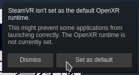
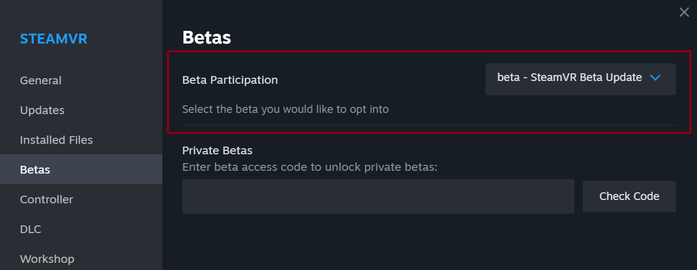

# Docker Ubuntu based SteamVR
An example of Steam and SteamVR working within an Ubuntu Docker container

## Requirements
Make sure that you have `nvidia-container-toolkit` installed.

Follow this guide to install `nvidia-container-toolkit`:
https://docs.nvidia.com/datacenter/cloud-native/container-toolkit/latest/install-guide.html

## Building
Build container with:
```bash
make dev
```
Enter container with:
```bash
docker exec -it --privileged steamvr_dev_<user>_<branch> bash
```

## Running First time
### Setup Steam and SteamVR
1. Open steam (running `steam` in the container) and login to steam. Install SteamVR.
2. Launch SteamVR running `steamvr` (alias for `$HOME/.steam/debian-installation/steamapps/common/SteamVR/bin/vrmonitor.sh`)
3. Set default runtime from the pop-up window:

   
4. If the pop-up window is not displayed, install an older version of SteamVR from the **Betas** settings section:

    

    After configuring, set **Beta Participation** to **None** and use the latest version of SteamVR.
### Setup conda environment to run in VR
 - Navigate to `/home/${USER}/bigym/`
 - Activate bigym conda environments: `conda activate bigym`
 - Install dependencies: `pip install -e ".[dev]"`
 - Run demo recorder: `python tools/demo_recorder/main.py`
